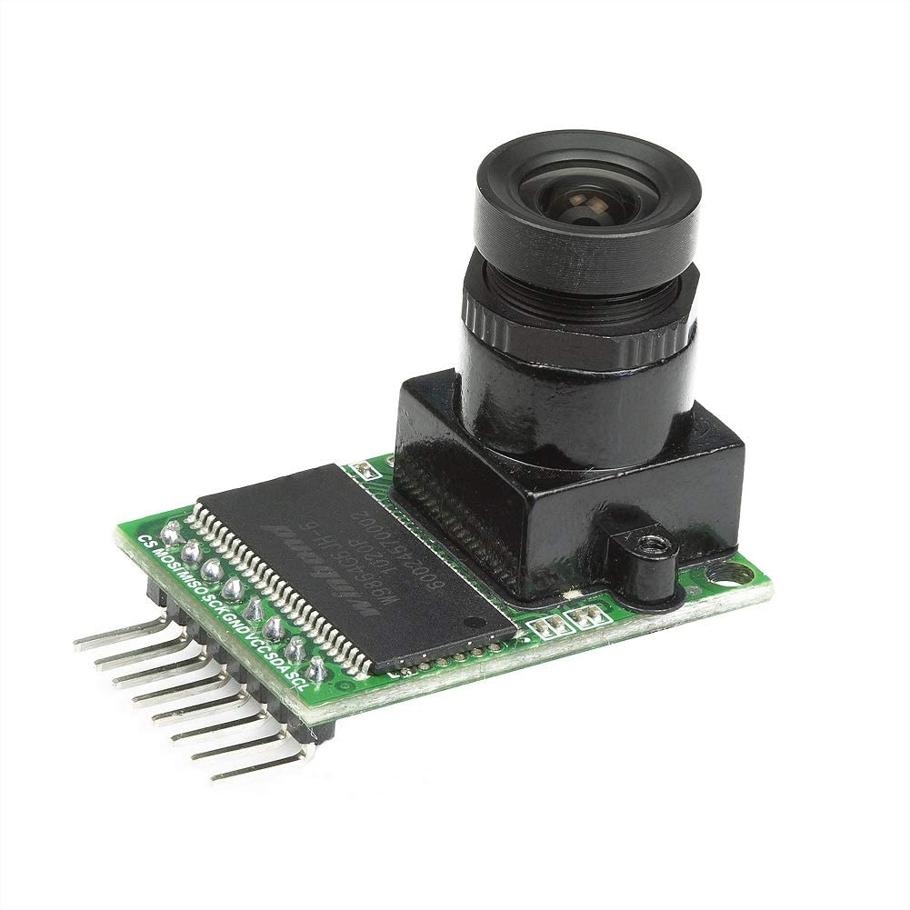
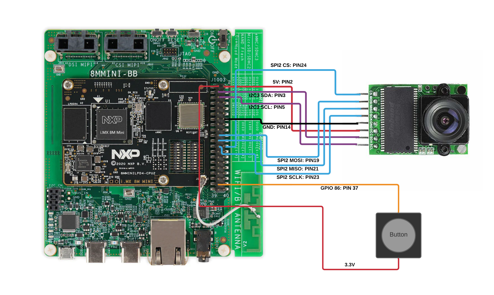

# Smart-Doorbell with IDS monitoring feature

## Build smart doorbell
Ancyr instrumentation has been added into smart doorbell makefile. The code of [Ancyr instrumentation](https://github.com/bgnetworks/ids-instrumentation) is automatically pulled in from the repository when clone the source of the smart doorbell.

```bash
git clone git@github.com:bgnetworks/Smart-Doorbell.git smart-doorbell
cd smart-doorbell
```

Refer to [meta-bgn-ids](https://github.com/bgnetworks/meta-bgn-ids/blob/gatesgarth/docs/Quick_Start_Guide.md) to create NXP imx8mm evk images and SDK before building smart door-bell

### define monitored operations and operation path
The metadata regarding which operations and paths would be monitored by the Ancyr agent is kept in a separate directory, `metatdata`, which is hard coded in the smart doorbell makefile. A example of path csv file is like:

```
main_matrix,main_svm,main_converge,
Camera_single_capture,Camera_save_capture_to_file
```
Two paths are monitored by Ancyr agent, the first of which includes three operations, main_matrix, main_svm and main_converge, and the second of which includes two operations, Camera_single_capture and Camera_save_capture_to_file.

There are another three entrance operations that are not monitored but must be included, main, math_thread_handler, doorbell_thread_handler. Those functions are stored in `included_operations.csv`

### build smart doorbell to generate excluded operations
* A symbol file, `sym.txt`, is exported to `metadata` direcotry in the first build.
```bash
# build smart-doorbell
make
```
* feed the symbol file, path file and included operation file to `ancyr-instrumentation\scripts\gen_excluded_operations.py` to create a excluded operations file.
```bash
python3 ancyr-instrumentation\scripts\gen_excluded_operations.py --symbol_file metadata/sym.txt --path_operations metadata/path3.csv --output_dir metadata --included_operations metadata/included_operations.csv
```
* rebuild the smart doorbell. The excluded operation file, `excluded_operations.ids`, has been hard coded in the makefile. If it doesn't exist, all operations would be monitored by Ancyr agent.
```bash
# clean smart-doorbel build
make clean
# build smart-doorbell
make
```
### Create operation-ID-map file
Use `ancyr-instrumentation\scripts\gen_operation_id_map.py` to map operation address to ID and export it to a file named `operation_id_map.csv`. It is needed by [Ancyr training](https://github.com/bgnetworks/ids-training)
```python
python3 ancyr-instrumentation\scripts\gen_excluded_operations.py --symbol_file metadata/sym.txt --path_operations metadata/path.csv --output_dir metadata --excluded_operations metadata/excluded_operations.ids
```

## use of smart doorbell on imx8mm evk
SCP smart doorbell to imx8mm evk board and execute it
```bash
# unlimited iterations
./smart-doorbell
```

```bash
# 1000 iterations
./smart-doorbell -s 1000
```

---

# Smart-Doorbell


[](https://raw.githubusercontent.com/lvoytek/Smart-Doorbell/main/LICENSE)

A smart doorbell developed in C++ with notifications and a live video stream

## Hardware

### SoC

Supports the following SoC's

- [Raspberry Pi 4](https://www.raspberrypi.org/products/raspberry-pi-4-model-b/)
- [i.MX 8M Mini Applications Processor](https://www.nxp.com/design/development-boards/i-mx-evaluation-and-development-boards/evaluation-kit-for-the-i-mx-8m-mini-applications-processor:8MMINILPD4-EVK)

### Camera

This repository supports the [Arducam 5MP OV5642](https://www.amazon.com/Arducam-Module-Camera-Arduino-Mega2560/dp/B013JUKZ48/ref=sr_1_4?dchild=1&keywords=arducam+5mp&qid=1610152383&sr=8-4) camera module for getting a live video feed



## Wiring

### i.MX 8M


